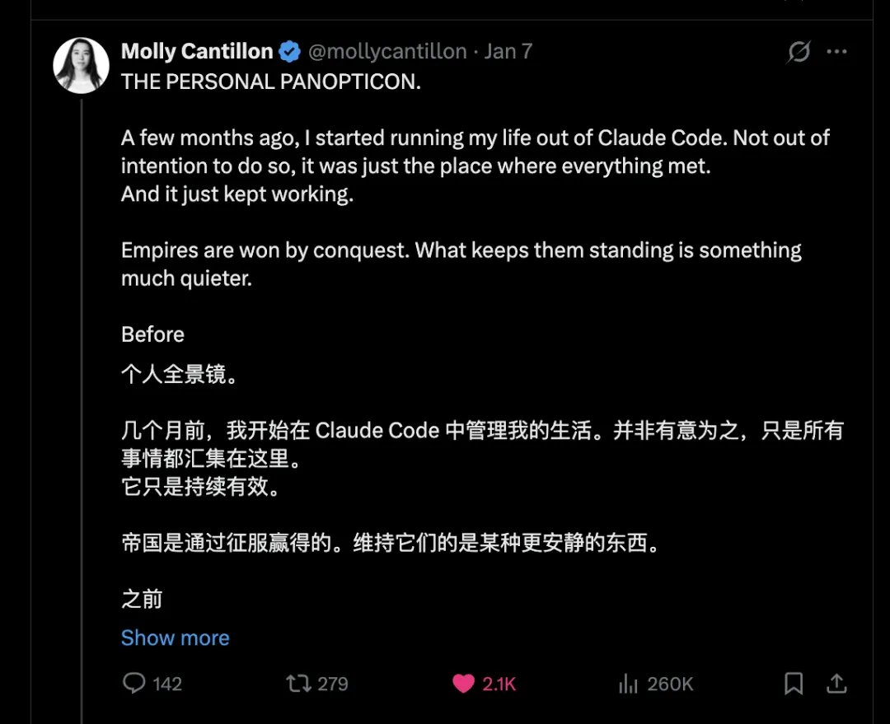

# 今年最具启发的Claude Code用例：她用cc搭了8个Agent监控自己的生活


今天在X上读到了一个极具启发的Claude Code使用案例。



说起来，我写过很多Claude Code的经验分享了。我现在频繁用它写代码、写文章、分析股票，最近还在尝试用它做Polymarket的预测分析。

但读到Molly Cantillon这篇文章的时候，我还是愣住了。

**她特么不只是用Claude Code。她是把整个人生都跑在Claude Code目录里。**

8个并行Agent实例，24小时运行，从产品运营到个人财务，从邮件处理到睡眠管理。

这种Agent Native的生活方式，让我觉得还挺有科幻感的。

## 她是谁？


Molly Cantillon，21岁，Stanford CS & Math辍学创业。

2023年创立NOX——一个AI驱动的个人助手，可以帮你预订餐厅、处理邮件、打电话、追踪目标。

2025年入选Forbes 30 Under 30 AI榜单，是最年轻的入选者之一。

投资方包括OpenAI Startup Fund。

在创业之前，她在Replicate、Microsoft、LangChain都待过。

她最近发了一篇长文，叫《The Personal Panopticon》（个人全景监控）。Tyler Cowen在Marginal Revolution上说这可能是"今年最重要的文章之一"。

这评价有点高。但读完她的Claude Code用法之后，我倒是理解了为什么。

## 8个并行实例，同时运行

她的架构是这样的：

```
~/nox # 产品运营
~/metrics # 数据分析
~/email # 邮件处理
~/growth # 增长策略
~/trades # 交易分析
~/health # 健康管理
~/writing # 写作
~/personal # 个人事务
```

8个Claude Code实例，同时运行。

每个实例独立运行，各司其职。遇到复杂任务，会自动spawn短期子代理来处理。需要跨领域协作时，通过显式的handoffs传递上下文。

她用`caffeinate -i`让Mac保持唤醒，这样即使她在机场赶路或者睡觉，任务也能继续跑。

任务完成后会发短信通知她，她回复checkpoint继续。

所有的思考轨迹都被记录下来，用于"递归自我改进"。

## 具体怎么用的？

这是我最感兴趣的部分。她给了一些具体的用例。

### 1. 产品运营：NOX on a Cron Job

她的产品NOX现在跑在一个cron job上。

具体做什么呢？拉取Amplitude数据（产品分析平台），交叉引用GitHub上的代码变更，然后指出"哪些东西需要构建"。

这个我能理解。很多团队的产品分析是：产品经理看Amplitude报表，然后告诉开发该做什么。

她把这个流程自动化了。Claude Code直接读数据，直接给出建议。

更夸张的是，它还能处理A/B测试、生成winning copy（就是那些转化率更高的文案），甚至把客户支持变成"完全自主的部门"。

最后这个我不太确定具体怎么实现的，但她原话是"turned customer support into a fully autonomous department"。

### 2. 邮件：首次实现Inbox Zero

她说这是她第一次实现inbox zero。

二十多个收件箱，成千上万封邮件。

Claude Code帮她自动起草回复，处理所有入站邮件。

### 3. 交易分析：每天早上一份简报

这个用法我太熟悉了，因为我也在尝试类似的东西。

她的~/trades目录会在夜间自动运行。它会"picks the locks of brokerages that refuse to talk to each other"（撬开那些拒绝互通的券商的锁），拉取国会和对冲基金的持仓披露，抓取Polymarket的赔率和X上的情绪分析，再加上新闻和10-K年报。

每天早上，一份简报会出现在~/trades目录下。

她给了一个具体例子：上个月她的系统发现众议员Fields在买入Netflix股票。三周后，Warner Bros并购案公布。

她说："我不总是交易，有时候会和这个分析论点争论好几天。但我再也不用早上6点追踪十五个标签页了。"

这种"surveillance yourself"（监控自己）的感觉，她形容为"borderline unfair"（几乎不公平）。

### 4. 订阅管理：找回了$2000

她让Claude Code扫描了她所有的订阅。

结果？找回了$2000她不知道自己在付的钱。

还有那些SFMTA（旧金山交通局）的罚单、一直拖着没处理的待办事项，都被自动处理了。

### 5. 睡眠：WHOOP + 投影仪

这个用法有点极客。

她搭了一个系统：连接WHOOP（那个健康追踪手环），在睡满6小时后，自动用投影仪播放她喜欢的句子来叫醒她。

### 6. 健身：适应不规律的行程

她经常出差，行程很乱。

Claude Code帮她规划健身计划，自动适应这种不规律的时间表。

### 7. Jmail：一夜之间解析Epstein文件

这个项目有点传奇。

几周前，Epstein文件公开。她和五个朋友一起，用Claude Code在一夜之间把几千份文档解析成可搜索的索引。

航班记录、短信、照片、Amazon购买记录、房产信息，全部可搜索。

到早上7点，他们发布了Jmail。到现在已经有1800万人搜索过这个系统。

她说："十年前这需要一个团队和一个季度的runway。我们一夜之间就做完了，靠的是纯肾上腺素和终于能跟上野心的工具。"

## 技术细节

她还透露了一些技术实现细节。

### 桌面操作

当API不存在的时候，Claude Code会直接操作桌面——注入鼠标和键盘事件，自动点击和输入。

这意味着它可以操作任何应用程序，不管有没有API。

### 保持运行

`caffeinate -i` 命令让Mac保持唤醒，不休眠。

任务完成后发短信通知，她回复继续。

### 思维轨迹记录

所有的思考过程都被记录和artifact化，用于"递归自我改进"。

这个概念很有意思：让agent学习自己的错误，越跑越聪明。

## "个人全景监控"是什么意思？

Molly的文章不只是技术分享，还有一层哲学思考。

她从历史讲起。

在前现代社会，国家对老百姓一无所知——不知道你有多少财产、住在哪里、甚至不知道你是谁。

所以国家建立了"让人可见"的基础设施：人口普查、姓氏、地图。

这叫"legibility"（可读性）。

可读性是统治的前提。

后来，企业也学会了这一套。它们收集你的行为数据，但你无法访问、更无法理解这些数据。

你是历史上被测量得最多的人，但对自己最不透明。

她的观点是：Claude Code让这种权力关系逆转了。

以前是国家/企业监控你。现在你可以监控自己。

监控塔还在，但塔属于你。

## 但她也提出了警告

文章最后，她提出了一些警告。

### Goodhart定律

"当你优化一个指标时，你可能会把目标本身给毁了。"

她举例：当WHOOP说她"恢复良好"但她感觉像死了一样的时候，她会注意到。当~/trades的论点是错的，她会亏钱。

这种"活在系统之外的meta层"很重要。

### 不要被系统吞噬

她提到一部剧叫《Pluribus》，讲的是80亿人融入一个集体意识，只剩13个人在外面。

LLM已经有点像那样了：人类的lossy compression（有损压缩），用一个声音说话。

当你的整个生活都跑在Claude Code目录里，你会感到"融入的引力"。

她的建议是：

**早点拿下这个工具，但不要让它拿下你。**

## 几个值得借鉴的点

### 1. 从"单点使用"到"系统化架构"

大多数人用Claude Code的方式是：有任务了，开个session，搞定，关掉。

Molly的做法是：8个目录，8个独立的agent，24小时运行，各司其职。

这是两种完全不同的思路。前者是"工具"，后者是"基础设施"。

### 2. 从"AI帮我做事"到"AI帮我看见自己"

这个视角转换很有意思。

传统思路：AI是执行者，帮你完成任务。

她的思路：AI是观察者，帮你汇总所有信息流，识别模式，生成行动建议。

这不只是效率工具，是一种新的自我认知方式。

### 3. 保持在系统之外的meta层

当你的生活完全量化、完全依赖系统，你可能会失去一些东西。

Goodhart定律：当你优化一个指标，指标本身可能会失效。

她的做法是：当WHOOP说"恢复良好"但感觉像死了一样，她会注意到。当~/trades的论点错了，她会亏钱。

这种"活在系统之外"的能力很重要。当指标变成游戏，你要能识别出来。当系统不再服务于你，你要能删掉它。

## 怎么开始？

如果你也想尝试类似的架构，我的建议是：

### 第一步：从一个领域开始

不要一上来就搞8个并行实例。

先选一个你最需要的领域：邮件、写作、投资、健康，随便哪个。

搭建一个Claude Code工作流，跑通它。

### 第二步：结构化你的目录

```
~/claude/
├── work/ # 工作相关
├── personal/ # 个人事务
├── finance/ # 财务/投资
└── health/ # 健康
```

每个目录有自己的CLAUDE.md，定义规则和工作流。

### 第三步：考虑自动化

Molly用的是cron job + caffeinate + 短信通知。

你也可以用GitHub Actions做定时触发，或者用Mac的launchd来跑定时任务，再配合各种webhook和API集成。

### 第四步：记录和迭代

她说"所有思维轨迹都被记录，用于递归自我改进"。

这个很重要。让你的agent学习自己的错误。

## 最后

Karpathy说过一句话，大意是：现在还不用AI编程工具，那是你自己的问题。

Molly Cantillon可能是我见过的把这个理念执行得最彻底的人。

她不是把AI当工具。她是把AI当基础设施，把整个生活建构在上面。

几百年来，可读性（legibility）的流向是向上的：你是被监控的对象，机构是监控者。

现在，方向可以反过来了。

**管理好你自己。**

## 相关链接

- Molly Cantillon的X账号：https://x.com/mollycantillon
- 原文链接：https://x.com/mollycantillon/status/2008918474006122936
- 个人网站：https://www.mollycantillon.com/
- Marginal Revolution评论：https://marginalrevolution.com/marginalrevolution/2026/01/the-molly-cantillon-manifesto-a-personal-panopticon.html
- 信息来源：感谢范冰老师在即刻的分享 https://web.okjike.com/u/160F8D03-E580-4799-8D02-B86B1A6FBF64/post/695f22fa25bae56612561d94

---

**Posted:** 2026-01-09 10:55
**Likes:** 853 | **Reposts:** 219 | **Replies:** 27 | **Views:** 131,126

[View original on X](https://x.com/AlchainHust/status/2009458970629660735)
